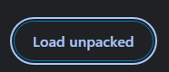

# TTTK 
ProfAI track for Global AI Hackathon Hack-nation 2025 </br>
Project implemented using OpenAI and ElevenLab
## Prerequisite
- Clone the repo
```
git clone https://github.com/K0iNguyen/TTTK/
```
- Setup Python Virtual Enviroment
```
python -m venv .venv
source .venv/bin/activate
```
- Install dependent python packages
```
pip install -r requirements.txt
```
- Setup API keys in .env file in ${workspaceFolder} <i><b>(Do not ever save your api key in a nonhidden file)</b></i>
```
OPENAI_API_KEY = <YOUR OPENAI API KEY>
ELEVEN_API_KEY = <YOUR ELEVENLAB API KEY>
```
## Setup Chromium Extension and Start Running Service
### Extension Setup
<br>
Click on Manage Extensions.<br><br>
<br>
Turn on Developer Mode.<br>
<br><br>
Upload <b>${workspaceFolder}/SrcWeb</b> folder.
### Run Serivce
- Run the command below before using the extension:
```
python start_server.py
```
## General Software Architecture
Front-End is stored in <b>SrcWeb.</b> Back-End is stored in <b>SrcPy.</b><br><br>
SrcWeb contains:
- background.js : Background service
- content.js : Extensions Functions
- manifest.json : Extensions Setting
- popup.css : Extensions Design
- popup.html: Extensions Layout
- popup.js : Button Functions

SrcPy contains:
- bot_api.py : OpenAI API library
- eleven_api.py : Eleven Lab API library
- get_net.py : Flask Server backend
- textify.py : Converting raw HTML to relevant plain text chunk
- window_chat.py : Chatbox Back-End